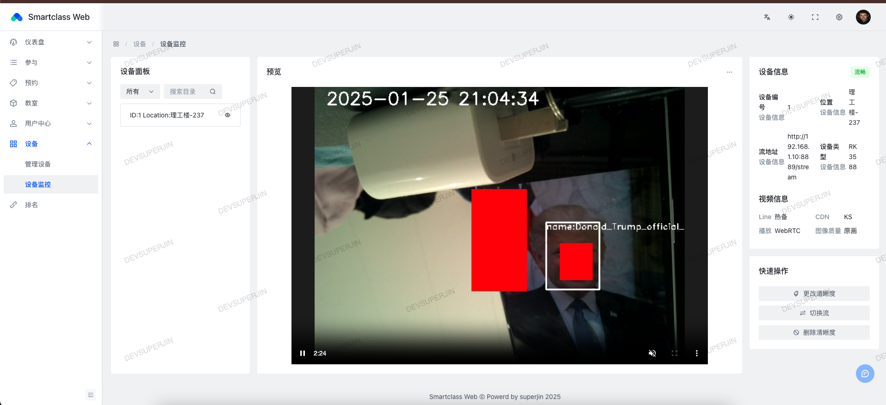
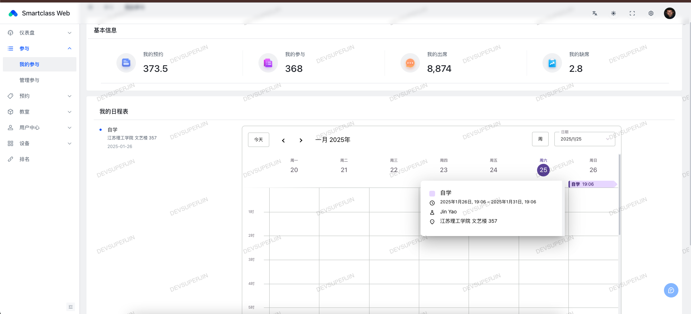
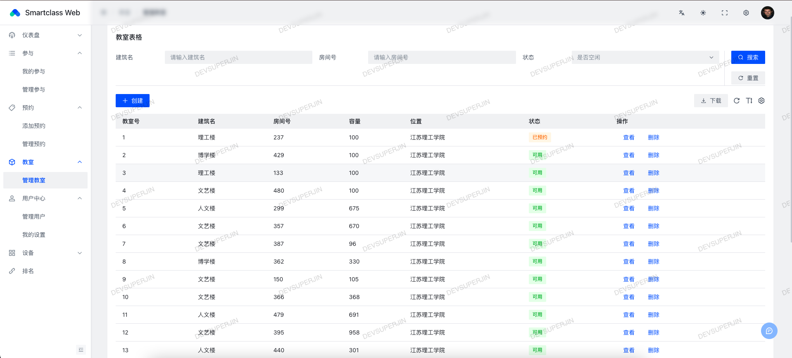
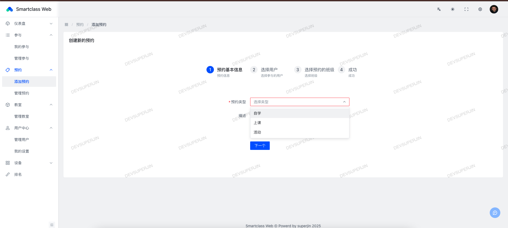

# 智慧教室系统 (Smart Class)

本项目是一个集成的智慧教室解决方案，由三个模块组成：`smartclass-web`、`smartclass-backend` 和 `smartclass-node`。

## 项目组成

1. **smartclass-web**  
   本项目的前端

2. **smartclass-backend**  
   本项目的后端

3. **smartclass-node**  
   本项目的设备端

## 项目架构

  这里暂时省略一张图片

## 系统功能

- **智能考勤**  
  系统可以自动识别学生和教师的身份并进行考勤打卡，减少人工干预。

- **课程预约与管理**  
  用户可以在系统中查看课程安排，并预约教室。

- **设备管理**  
  管理教室内的智能设备，包括投影仪、音响、空调等，确保设备的正常运行。

- **数据统计与分析**  
  系统会自动统计教室使用情况，并生成详细的报表，帮助教务管理人员做出决策。

## 项目截图

### 1. Page 1

如图所示

### 2. Page 2

如图所示

### 3. Page 3

如图所示

### 4. Page 4

如图所示

### 5. Page 5

如图所示

## 协议与条款

如您需要在企业网络中使用 Next Stream，建议先征求 IT 管理员的同意。下载、使用或分发 Next Stream 前，您必须同意 [协议](./LICENSE) 条款与限制。本项目不提供任何担保，亦不承担任何责任。

## 快速安装

> 本项目未进行严格的安全性测试，不建议部署安装在公网环境。

- [原生安装](docs/install-naive.md)

## 特别感谢

> 暂无