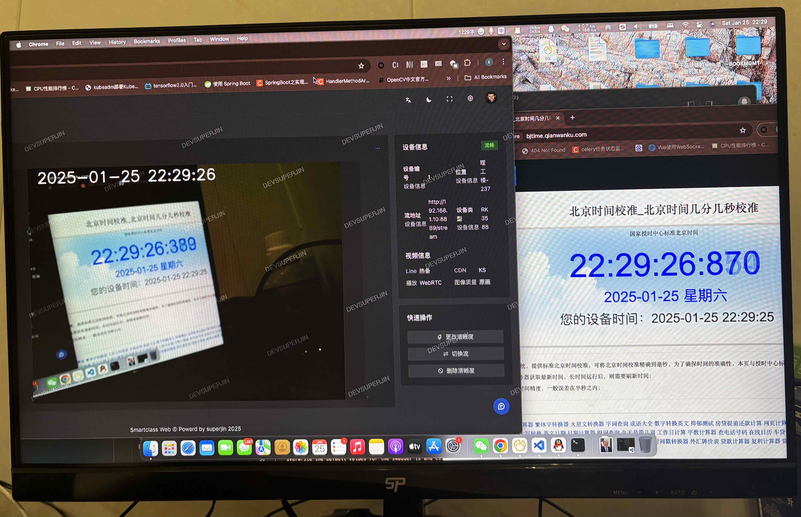
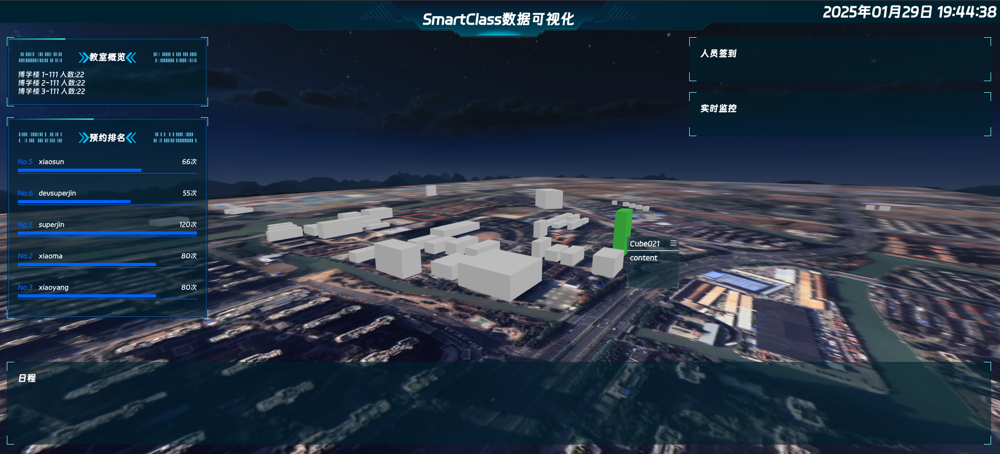

  <h1>智慧教室 (Smart Class)</h1>

## 项目介绍

一个集成的智慧教室解决方案(目前代码还是屎山状态，未来也不一定优化，不过Star多的话可以优化一下，项目整体还在开发中...)，包含了三个子项目：`smartclass-web`、`smartclass-backend` 和 `smartclass-node`。

项目提供了完整、可靠、系统性的一站式解决方案，目前部署起来可能会有一些复杂。(还在思考如何简化配置中...)

由于使用多个设备开发，所以习惯性写一点提交一点（理论上有三个库是访问不到的），详细代码请参考 `Release` 中版本，当然 Release 里的代码也是一坨屎山。

除此之外，是我的毕业设计。

## 项目组成

1. **smartclass-web**  
   本项目的前端，基于 Arco Design 开发，不仅提供了功能齐全的管理配置页面，还具有设备录像实时查看等功能。

2. **smartclass-backend**  
   本项目的后端，暂且基于Fastapi开发，后期会重构。

3. **smartclass-node**  
   本项目的设备端，暂且基于Python开发，目前可实现在RK3588、RK3566等Rockchip平台上实现实时推理与编码。

4. **others**  
   一些其他的依赖组件如 MediaMTX，MinIO，RabbitMQ 等，会在安装手册详细说明(当然现在还没有写...)。

## 项目架构

  这里暂时省略一张图片

## 系统功能

- **智能考勤**  
  系统可以自动识别学生和教师的身份并进行考勤打卡，减少人工干预。

- **课程预约与管理**  
  用户可以在系统中查看课程安排，并预约教室。

- **设备管理**  
  管理教室内的智能设备，包括投影仪、音响、空调等，确保设备的正常运行。(其实没有这些，这是AI写的，只有目前只有人脸闸机)

- **数据统计与分析**  
  系统会自动统计教室使用情况，并生成详细的报表，帮助教务管理人员做出决策。

## 二次开发

  对代码进行二次开发前，您必须同意 [协议](./LICENSE) 条款与限制。

### smartclass-web
这边的代码是基于arco design pro进行二次开发的，其实我都不好意思掏出来，因为被我添加了一锅大杂烩。(更重要的是里面的代码写的比较随心所欲)  

想要对这部分功能进行二次开发，建议先参照 `arco design pro` 中的文档初步了解前端项目结构。  

此外要对可视化部分进行二次开发 首先需要进入 `smartclass-web/src/views/visualization` 目录。这一部分使用了完全不同的框架，Datav VUE3 以及 Three.js 库和一些稀奇古怪的东西，也懒得优化了。其中项目中的建模是我的母校江苏理工学院。模型目录在...（自己找找吧）建模部分可以参考使用Blender + BelnderGIS插件完成(这个东西其实我也只会画方块上去)，完成后导出成`.glb`格式文件替换掉模型目录中的模型。其实这个目录是最需要重构一下的，比较乱。理论上建模的模型名需要符合一定的格式，确保它可以被选中，具体可以参照原码中的MouseClick事件，因为它的raycaster实际上可以是任意物体。对了这个天空盒是我偷来的，还有一些图片... 可以[参考](https://github.com/fh332393900/threejs-demo.git)这个项目。但其实它的界面不是很好看，所以结合了Datav Vue3 可以参考底部的链接对组件按需引入。

### smartclass-backend
这部分的代码采用Fastapi开发，代码格式比较差，应为是我用编辑器手搓的。其实后端工作量也不大，所以写的更加随心所欲。暂且能跑就行，其实Python开发有一点奇怪对吧？数据库字段没有很优雅地方式转换成驼峰命名。

### smartclass-node
这部分代码需要rk npu的支持，当然也可以使用rknn toolkit在pc上模拟推理，完全脱离需要自行重构。这部分代码是我手搓的，其中包含了三个server在core/server文件中，native.py是多线程推理，它使用了一个队列，实际上这部分在使用ffmpeg推流会存在一些问题，所以在rtmp中仅使用了单线程推理。这个模块整体完成度较高，但是也没有搞完。

## 项目截图

### 1. 设备监控
(红色区域为手工PS,排除审核风险)

### 2. 我的参与
我的参与包含了日程表及信息统计功能。

### 3. 教室管理
教室管理包含了教室的添加删除等功能。

### 4. 创建预约
创建预约包含了一个分步表单。

### 5. 低延时、高性能
系统从`图像采集解码->图像处理及推理->编码->推流->WEB端拉流预览`整体延时约在500ms左右。

### 6. 数据可视化
该模块提供了丰富的数据展示，系统教学楼可视化查看及配置等功能(开发中...)

## 协议与条款

如您需要在生产环境中使用 Smart Class，建议先征求 **单位负责人** 的同意。下载、使用或分发 Smart Class 前，您必须同意 [协议](./LICENSE) 条款与限制。本项目不提供任何担保，亦不承担任何责任。

## 快速安装

> 本项目未进行严格的安全性测试，不建议部署安装在公网环境。

- 暂无

## 参考

- Arco Design [link](https://github.com/arco-design/arco-design.git)
- FastAPI [link](https://github.com/fastapi/fastapi.git)
- RKNN-Toolkit [link](https://github.com/rockchip-linux/rknn-toolkit.git)
- InsightFace [link](https://github.com/deepinsight/insightface.git)
- Datav Vue3 [link](https://github.com/vaemusic/datav-vue3.git)