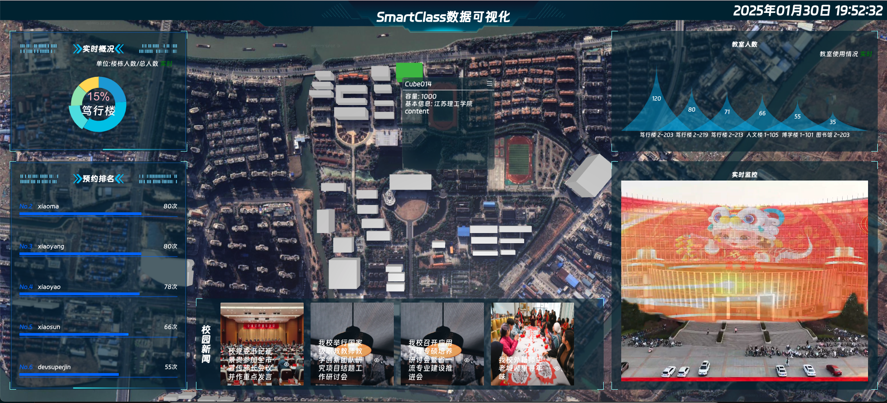

  <h1>Smart Class</h1>

# 智慧教室 (Smart Class)

一个集成的智慧教室解决方案(目前代码还是屎山状态，未来也不一定优化，项目整体还在开发中...)，包含了三个子项目：`smartclass-web`、`smartclass-backend` 和 `smartclass-node`。除此之外，是我的毕业设计。

## 项目组成

1. **smartclass-web**  
   本项目的前端，基于 Arco Design 开发，不仅提供了功能齐全的管理配置页面，还具有设备录像实时查看等功能。

2. **smartclass-backend**  
   本项目的后端，暂且基于Fastapi开发，后期会重构。

3. **smartclass-node**  
   本项目的设备端，暂且基于Python开发，目前可实现在RK3588、RK3566等Rockchip平台上实现实时推理与编码。

4. **others**  
   一些其他的依赖组件如 MediaMTX，MinIO，RabbitMQ 等，会在安装手册详细说明(当然现在还没有写...)。

## 项目架构

  这里暂时省略一张图片

## 系统功能

- **智能考勤**  
  系统可以自动识别学生和教师的身份并进行考勤打卡，减少人工干预。

- **课程预约与管理**  
  用户可以在系统中查看课程安排，并预约教室。

- **设备管理**  
  管理教室内的智能设备，包括投影仪、音响、空调等，确保设备的正常运行。

- **数据统计与分析**  
  系统会自动统计教室使用情况，并生成详细的报表，帮助教务管理人员做出决策。

## 项目截图

### 0. 仪表板
仪表板包含了系统基本的统计信息，公告等。

### 1. 用户设置
如图所示

### 2. 设备监控
(红色区域为手工PS,排除审核风险)

### 3. 我的参与
我的参与包含了日程表及信息统计功能。

### 4. 教室管理
教室管理包含了教室的添加删除等功能。

### 5. 创建预约
创建预约包含了一个分步表单。

### 6. 低延时、高性能
系统从`图像采集解码->图像处理及推理->编码->推流->WEB端拉流预览`整体延时约在500ms左右。

### 7. 数据可视化
该模块提供了丰富的数据展示，系统教学楼可视化查看及配置等功能(开发中...)

## 协议与条款

如您需要在生产环境中使用 Smart Class，建议先征求 **单位负责人** 的同意。下载、使用或分发 Smart Class 前，您必须同意 [协议](./LICENSE) 条款与限制。本项目不提供任何担保，亦不承担任何责任。

## 快速安装

> 本项目未进行严格的安全性测试，不建议部署安装在公网环境。

- 暂无

## 参考

- Arco Design [link](https://github.com/arco-design/arco-design.git)
- FastAPI [link](https://github.com/fastapi/fastapi.git)
- RKNN-Toolkit [link](https://github.com/rockchip-linux/rknn-toolkit.git)
- InsightFace [link](https://github.com/deepinsight/insightface.git)
- Datav Vue3 [link](https://github.com/vaemusic/datav-vue3.git)